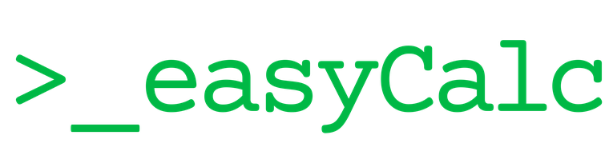

<div align="center">



### Fast, local project costing & quoting for AV / integration work


### [⬇️ Download EasyCalc for Windows](https://github.com/skolvolt/EasyCalc/releases/latest)

<sub>No terminal needed — click above, open the `.exe` under **Assets**, and run it.</sub>

</div>

---

**EasyCalc** turns a room‑by‑room equipment schedule into live pricing, margins,
quotes and invoices — all on your own machine. Build a project, allocate
equipment and labour across system types, and watch revenue, cost, gross profit
and margin update instantly. Export polished PDFs and Excel workbooks, import
supplier pricelists, and share a project as a single portable file.

Nothing is sent anywhere. Projects are plain files you own.

## ✨ Features

- **📋 Equipment schedule** — a spreadsheet‑style grid with copy/paste, range
  select, multi‑cell delete, and per‑cell value history. Mark‑up, sell and
  margin all back‑solve each other.
- **🏨 Rooms & system types** — define room types once, allocate quantities per
  room, and totals roll up automatically.
- **🧰 Labour & materials** — labour, cables and parts with per‑category
  contingency.
- **📊 Live dashboard** — revenue, cost, gross profit, margin and a per‑category
  P&L that update as you type. Editable GST.
- **🧾 Quotes & invoices** — room summaries, per‑room invoices and a full project
  invoice, exported to **PDF** and **styled Excel**.
- **🛒 Procurement** — a supplier‑sorted buy list; import supplier pricelists
  (`.xlsx`/`.csv`) and update costs in a click.
- **💱 Live currency** — quote in AUD, USD, GBP, EUR and more at today's rate.
- **🌐 Portable copy** — export a whole project as one self‑contained `.html`
  that opens in any browser, no install.
- **🔄 Auto‑updates** — checks for new releases on launch and updates in place.

## ⬇️ Download & install

### Windows
1. Grab the latest **`EasyCalc-Setup-x.y.z.exe`** from the
   [**Releases**](https://github.com/skolvolt/EasyCalc/releases/latest) page.
2. Run it — installs per‑user (no admin prompt) and adds Start Menu + Desktop
   shortcuts.
3. Launch **EasyCalc**. It opens in its own window; the background service shows
   as `EasyCalc.exe` in Task Manager.

> First launch may show a Windows SmartScreen notice (the app isn't code‑signed):
> **More info → Run anyway**.

### macOS
Build the `.dmg` on a Mac from source — see [`mac-build/`](mac-build/). It
produces a drag‑to‑Applications disk image. (First launch: right‑click → Open to
clear Gatekeeper, since it isn't notarized.)

**What's new:** see the [**changelog**](CHANGELOG.md). The app auto‑updates from
the Releases page on launch.

## 🗂️ How it works

EasyCalc is a small local web app: a bundled Node service serves a browser UI on
`localhost`, so it runs as a self‑contained desktop app with no external
dependencies. Projects are saved as `.qmproj` files (plain JSON) in
`Documents/Project Model` — copy or send one to share a project.

## 📁 Project structure

| Path | What it is |
|------|-----------|
| `src/shared/` | Calculation engine + shared types (the pricing/rollup logic) |
| `src/server/` | Local API: projects, imports, PDF/Excel export, updates |
| `web/src/` | React UI — views, spreadsheet grid, dashboard, invoices |
| `data/seed.json` | Starter template a new project begins from (ships empty — no pre-filled costs) |
| `package-build/` | The packaged app payload + launchers shipped to users |
| `installer/` | Windows installer script (Inno Setup) |
| `mac-build/` | macOS `.dmg` build script |
| `RELEASING.md` | How releases are cut |

## 🛠️ Development

```sh
npm install
npm run dev      # Vite UI + API with hot reload
npm test         # unit tests
npm run package  # build the shippable web + server bundle
```

## 📄 License

Proprietary — © 2026 The Roach House. All rights reserved. See
[`LICENSE.txt`](LICENSE.txt).
